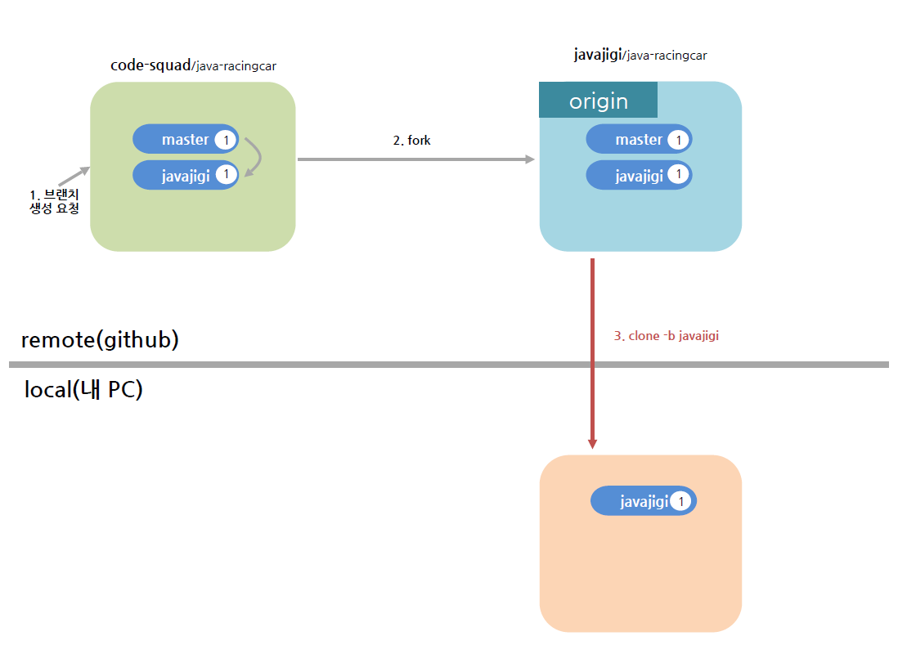
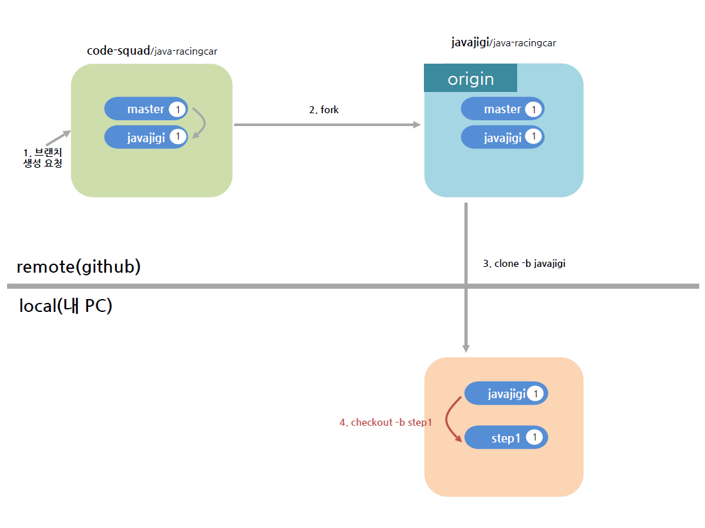
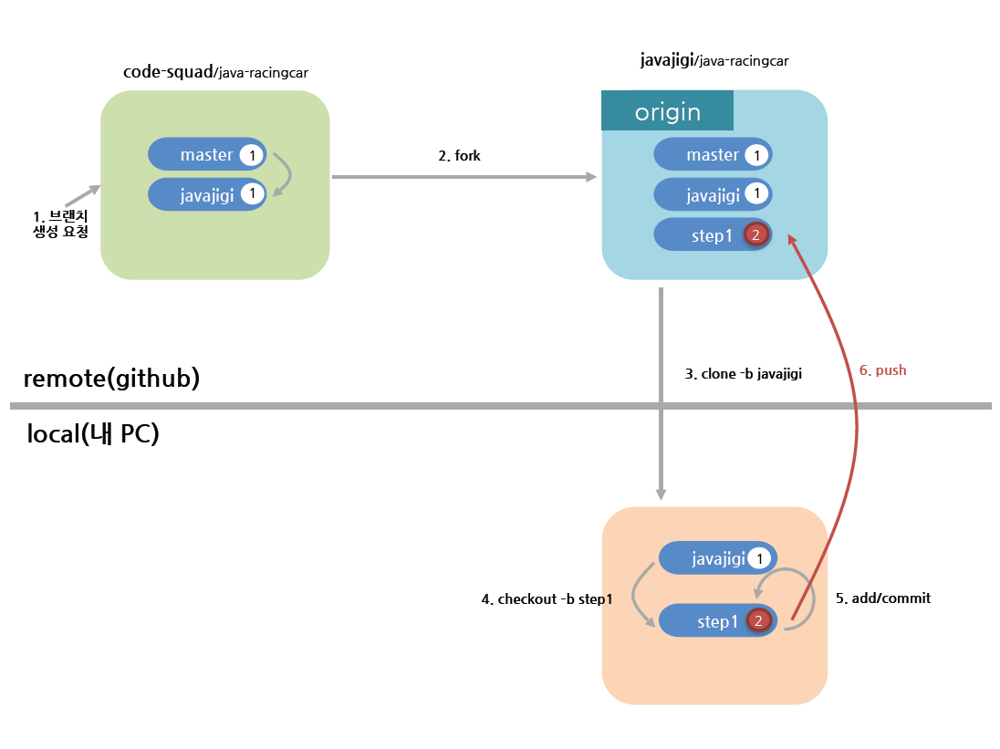
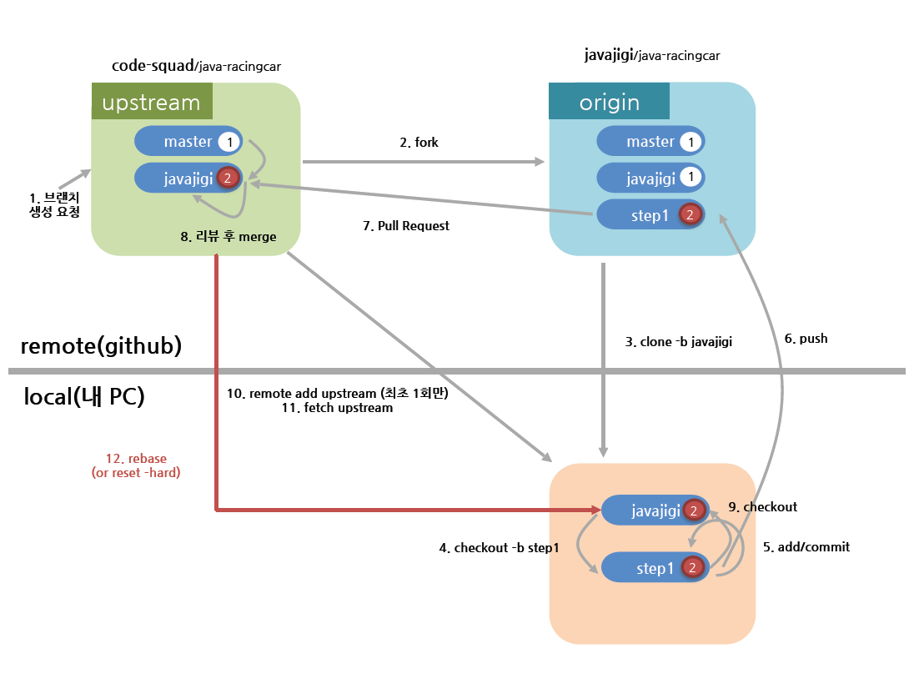
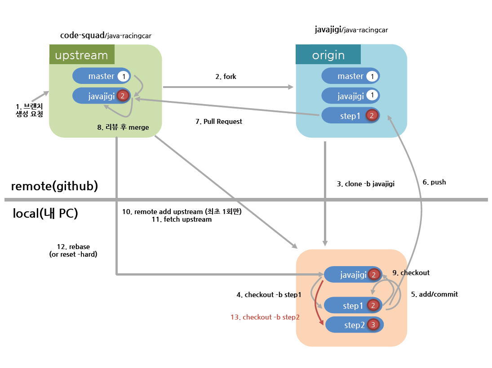

# 코드스쿼드 온라인 코드 리뷰 과정

최종수정일: 2020년 2월 8일
최초작성자: 포비 (자바지기 박재성)

## 초기 상태

- 초기 상태 코드스쿼드의 깃헙 저장소(이하 업스트림) 상태는 다음과 같다.


## 머지용 브랜치 생성

- 저장소 브랜치에 자신의 github 아이디에 해당하는 브랜치가 있는지 확인한다.
- 브랜치가 없는 경우 lucas의 브랜치 생성 기능을 이용한다.
- 잘 안 될 경우 마스터에게 브랜치 생성을 요청한다.


## fork

- 프로젝트를 자신의 계정으로 fork한다. 
- 깃헙 코드스쿼드 페이지 우측 상단의 fork 버튼을 활용한다.


## 내 PC로 클론 

- 복사한 저장소(이하 오리진)를 자신의 컴퓨터로 clone한 후 디렉토리로 이동한다.
- 단순 clone을 하면 너무 많은 브랜치를 가져오므로 유의하자.

### 내 브랜치만 클론하기

```bash
# git clone -b {본인_아이디} --single-branch https://github.com/{본인_아이디}/{저장소 아이디}
git clone -b honux77 --single-branch https://github.com/honux77/github-playground
```

### 작업폴더로 이동

```bash
# cd {저장소 아이디}
$ cd github-playground
```



## 구현 브랜치 생성

- 기능 구현을 위한 브랜치를 생성한다.
- 명확하게 알 수 있는 이름을 선택하자.

```bash
# git switch -c 브랜치 이름
git switch -c hello
```



## 기능 구현 후 add, commit

```bash
git status #확인
git rm 파일명 #불필요 파일 삭제
git add 파일명 #커밋할 파일을 스테이지에 추가
git commit #커밋 메시지를 자세히 적자
```


## push

- 작업한 내용을 본인 원격 저장소에 올린다.

```bash
# git push origin 브랜치이름
git push origin hello
```



## Pull Request 보내기

- GitHub에서 Pull Request를 보낸다.

> pull request는 업스트림 저장소의 브랜치(자신의 github 아이디)와 앞 단계에서 생성한 브랜치 이름을 기준으로 한다.

> pull request를 통해 피드백을 받으면 코드를 수정한 후 같은 브랜치에 add, commit, push 작업을 반복한다.

```bash
ex) code-squad/java-racingcar javajigi 브랜치 기준 => javajigi/java-racingcar step1
```


## 다음 단계 시작하기

- 일반적으로 리뷰 완료가 다음 단계 개발보다 늦어지므로 다음 단계 개발을 먼저 시작하게 된다.
- 마지막 커밋에서 브랜치를 새로 만들고 개발을 시작한다.

```
# git switch -c 새기능 [지정 커밋 체크섬]
git switch -c step2-board
# add, commit, push, ...
```

## 리뷰어 머지 

- ~~What is reviewer?~~
- 리뷰어는 피드백을 마무리하고 codesquad 저장소로 merge한다.


## 이전 브랜치 삭제

- merge 후 이전 브랜치는 불필요한 경우가 많다.
- merge를 완료했다는 통보를 받으면 브랜치 변경 및 작업 브랜치를 삭제한다.

```bash
# git checkout 본인아이디
# git branch -D 삭제할_브랜치이름
git checkout honux77
git branch -D hello
```


## 업스트림 저장소 추가 (최초 1회)

- 업스트림과의 동기화를 위해 codesquad 저장소의 자기 브랜치를 추가한다.
- 저장소 추가는 최초 1회만 수행한다.

```bash
# git remote add -t {본인_아이디} {저장소_별칭} base_저장소_url
ex) git remote add -t honux77 upstream https://github.com/code-squad/github-playground

#위와 같이 codesquad 저장소를 추가한 후 전체 remote 저장소 목록을 본다.
git remote -v
```

## 업스트림 저장소와의 동기화 

```bash
#git fetch upstream {본인_아이디}
git fetch upstream honux77
```


## 현재 작업중인 브랜치에 이전 단계 반영하기

- 깔끔하게 하기 위해 rebase로 작업한다.
- rebase는 여러번 충돌이 발생하므로 주의하자.
- rebase가 잘 안 될 경우 merge를 사용한다.
- 충돌해결이 여전히 어렵다면 강제로 최신버전을 덮어쓰도록 옵션을 지정해 보자.

```bash
# git rebase upstream/본인_아이디
git rebase upstream/honux77
```



## 이전단계 반복



## 동영상으로 살펴보는온라인 코드 리뷰

[github을 기반으로한 온라인 코드 리뷰 방법](https://youtu.be/a5c9ku-_fok)
